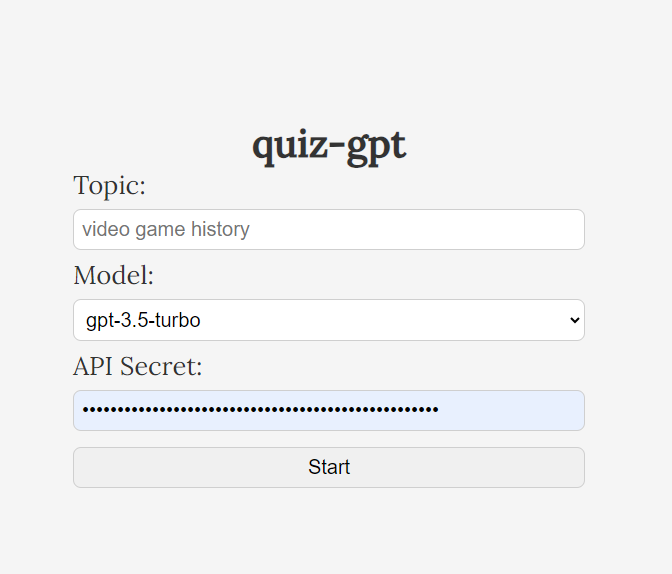
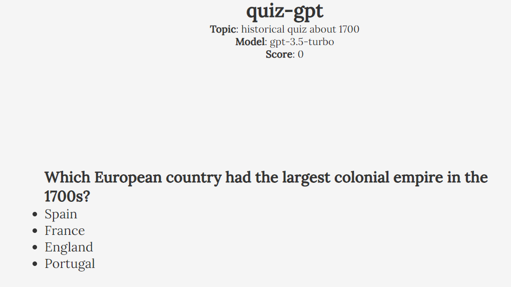

# 🧐 quizgpt 🧐


> First thing first, this is a just for fun project. It's not meant to be as polished and as good as a real game and may have some bugs or stupid code. I'm still learning. I'm open to any suggestions, improvements and feedback.

## Description

This is a simple quiz game that uses the OpenAI API to generate questions and answers using the ChatGPT models. The game is played by a user who can choose any topic they want. The user must select the correct answer to score a point. The game ends when the user selects an incorrect answer.

## Screenshots



> Main menu



> Historical questions

## How to play

### Online: Using the hosted version

You can play the game online at [quizgpt.shuka.rip](https://quizgpt.shuka.rip)
The API key is not stored on the server, it is only used to make requests to the OpenAI API. <br>

When you don't have trust in the hosted version, you can run it locally.

### Local: Using the Docker image

```bash
docker run -d -p 4200:80 --name quiz-gpt shukaaa/quizgpt:latest
```

### Local: Cloning the repository

1. Clone the repository

```bash
git clone https://github.com/Shukaaa/quizgpt.git
```

2. Install the dependencies

```bash
npm install
```

3. Run the project

```bash
npm start
```

## Usage

1. Enter a topic
2. Choose your ChatGPT model
3. Put in your API key (You can get one from https://platform.openai.com/api-keys)
4. Click on the "Start" button

